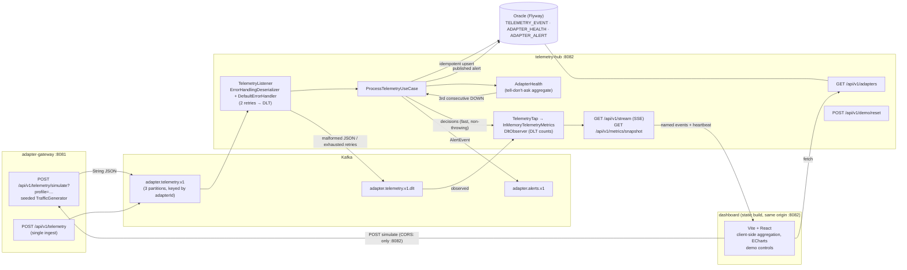

# kafka-adapter-telemetry

Adapter telemetry pipeline built for demonstration and interview walkthroughs: a
Kafka-producing **adapter-gateway** with a seeded traffic simulator, and a
**telemetry-hub** that persists to Oracle idempotently, tracks adapter health and
raises alerts. Java 25, Spring Boot 4.1, hexagonal architecture per service.

- **adapter-gateway** (`:8081`) — receives telemetry over REST and publishes JSON to
  Kafka; a deterministic traffic simulator drives demo profiles.
- **telemetry-hub** (`:8082`) — consumes telemetry, upserts it into Oracle (primary
  key idempotency), maintains per-adapter health and publishes alerts to Kafka;
  exposes a read API and a live SSE metrics tap, and serves the dashboard build.
- **contracts** — zero-dependency module shared by both services: `TelemetryEvent`,
  `AlertEvent`, value objects and the sealed `Result` type.
- **dashboard** (`dashboard/`, served at `:8082/`) — Vite + React single-page
  mission-control UI: live SSE stream, client-side aggregation and demo controls.

## Architecture



## Quickstart

Prerequisites: Docker, Java 25, Maven.

```bash
# 1. Infrastructure (Kafka + Oracle Free; --wait honours their healthchecks)
docker compose up -d --wait

# 2. Build (unit tests + EmbeddedKafka integration tests)
mvn -q package

# 3. Run the verified demo: starts both jars, runs low → high → overload
#    (twice), prints the SQL counts that prove idempotency and alerting
./demo.sh
```

Or run the services manually:

```bash
java -jar adapter-gateway/target/adapter-gateway-0.1.0-SNAPSHOT.jar   # :8081
java -jar telemetry-hub/target/telemetry-hub-0.1.0-SNAPSHOT.jar       # :8082
```

### Dashboard

The hub serves the mission-control dashboard at
[http://localhost:8082/](http://localhost:8082/). The build lives in
`dashboard/dist/`: `./demo.sh` builds it automatically when missing (npm
required on `PATH`; without npm the demo still runs, just without the UI), or
build it yourself once. Run the hub from the repo root so the relative
`file:dashboard/dist/` static location resolves.

```bash
npm --prefix dashboard install    # once
npm --prefix dashboard run build  # produces dashboard/dist/ (or let ./demo.sh do it)
npm --prefix dashboard run dev    # dev mode: Vite on :5173, /api proxied to :8082
```

Data is same-origin in production (hub serves both UI and API), so CORS plays no
role for it. Dev mode works through the Vite proxy (`/api` → `localhost:8082`).
The only cross-origin call is the demo control POST to the gateway, whose base
URL defaults to `http://localhost:8081` (override with `VITE_GATEWAY_URL` at
build time) and whose CORS configuration allowlists exactly
`http://localhost:8082`.

### Resetting the demo

The dashboard's **reset demo** button (or `POST /api/v1/demo/reset`) wipes the
demo state so the next run starts from zero: the three Oracle tables
(`telemetry_event`, `adapter_alert`, `adapter_health`) are truncated and the
hub's in-memory counters go back to zero. The stream's `seq` never rewinds, so
connected clients resync through the returned snapshot. Kafka topics are left
alone — consumer offsets are committed, so nothing is reprocessed.

Example calls:

```bash
curl -X POST 'localhost:8081/api/v1/telemetry/simulate?profile=low'
curl localhost:8082/api/v1/adapters
curl localhost:8082/api/v1/adapters/gateway-es-1
```

An optional Kafka UI ships under the `tools` compose profile on `:8090`:

```bash
docker compose --profile tools up -d kafka-ui
```

## Demo profiles

`POST /api/v1/telemetry/simulate?profile=…` runs a seeded, deterministic generator
(same profile → same event ids, which is what makes the idempotency demo repeatable).
Unknown profile → `400` with the list of valid ones.

| Profile    | Events | Rate  | Mix                                    | What it demonstrates                                        |
|------------|--------|-------|----------------------------------------|-------------------------------------------------------------|
| `low`      | 20     | 1/s   | 5% DOWN                                | clean end-to-end flow                                       |
| `moderate` | 100    | 10/s  | 5% DEGRADED                            | per-key aggregation, MERGE upsert                           |
| `high`     | 500    | 50/s  | 15% DOWN, 10% DEGRADED                 | **alerts**: 3 consecutive DOWN → exactly 1 alert per episode |
| `overload` | 2,000  | 200/s | 5% DOWN, 2% duplicates, 1% corrupt JSON | live idempotency + **DLT** + consumer lag                  |

## What to observe

1. **Idempotency** — re-running `overload` publishes the same event ids again; the
   database is the referee, not the consumer. The row count does not move:

   ```sql
   SELECT COUNT(*) FROM telemetry_event;
   ```

   Don't be surprised by the arithmetic: the full demo generates 2,460 events
   (20 + 500 + 1,940) but Oracle ends up with 2,365 distinct rows — under the shared
   demo seed, ~95 event ids collide across profiles and the primary key deduplicates
   them. Determinism is what makes replays safe, not what makes counts add up.

2. **Alerts** — every time an adapter accumulates 3 consecutive `DOWN` observations
   (an UP resets both the streak and the active alert), exactly one alert row and one
   `AlertEvent` appear. Alert ids are derived from the triggering event id, so
   replays of the same trigger never create a second alert:

   ```sql
   SELECT adapter_id, COUNT(*) FROM adapter_alert GROUP BY adapter_id;
   ```

3. **DLT** — the 1% corrupt JSON in `overload` is unparseable; after retries are
   exhausted (or the failure is fatal), the original bytes land unchanged in
   `adapter.telemetry.v1.dlt` instead of blocking the partition:

   ```bash
   docker exec telemetry-kafka /opt/kafka/bin/kafka-console-consumer.sh \
     --bootstrap-server localhost:9092 --topic adapter.telemetry.v1.dlt \
     --from-beginning --timeout-ms 5000
   ```

## Design docs

- [Plan and spec](docs/plan.md)
- [ADR-0001 — shared contracts module vs Schema Registry](docs/adr/0001-contracts-module-vs-schema-registry.md)
- [ADR-0002 — own sealed `Result` type vs libraries or exceptions](docs/adr/0002-result-vs-exceptions.md)
- [ADR-0003 — alert dual-write vs transactional outbox](docs/adr/0003-alert-dual-write-vs-outbox.md)
- [ADR-0004 — dashboard toolchain and the SSE tap](docs/adr/0004-dashboard-toolchain-and-sse-tap.md)

## Testing

| Level | What | Tooling |
|-------|------|---------|
| Unit (pure domain) | `Result`, value objects, `AdapterHealth` transitions, seeded `TrafficGenerator` | JUnit 5, no Spring |
| Application | use cases with in-memory fakes of the ports | JUnit 5 |
| Kafka integration | producer→consumer roundtrip, DLT routing | `@EmbeddedKafka` (runs in `mvn package`) |
| Oracle integration | idempotent stores against a real Oracle | Testcontainers (`OracleStoresIT`, excluded from the default build) |
| Hub metrics | tap frames, SSE snapshot/stream endpoints, DLT counting | JUnit 5 unit + `@WebMvcTest` + `@EmbeddedKafka` |
| Frontend unit/component | dashboard store, SSE client, series aggregation, UI components | Vitest + Testing Library (`npm --prefix dashboard test`) |
